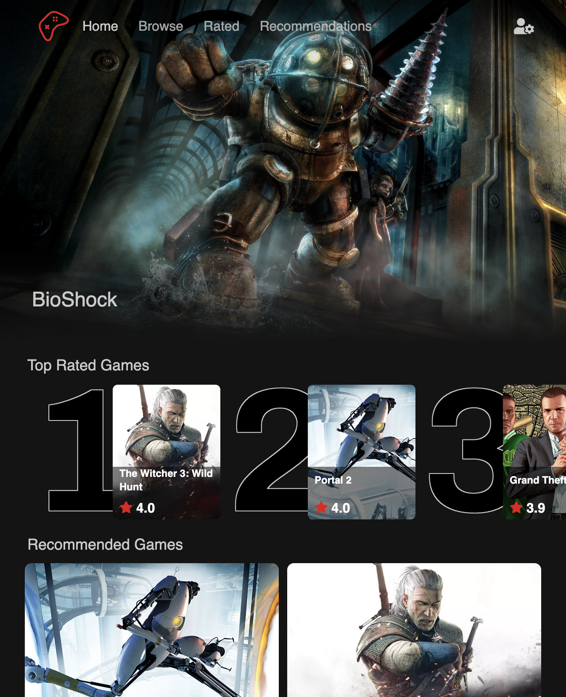

# Game Recommender Netflix Clone

This project aims to create a Netflix-like platform to understand and implement the User-Based Collaborative Filtering
recommendation algorithm from scratch. It serves as an opportunity to deepen my knowledge of
React and Typescript while developing a functional website that provides personalised game
recommendations based on user preferences and similiarity to other users.

For more advanced documentation, please see the documentation folder.

## Installation

### Server Setup

Activate Virtual Environment
`cd server`
`poetry init`
`poetry install`

### Run React Application

`cd client`
`yarn install`
`yarn dev`

Client server will be on
`http://localhost:5173/`

### Run Django and Documentation Server

`docker compose build`
`docker compose up`

Django Server
`http://localhost:8000/`
Django Admin Dashboard
`http://localhost:8000/admin/`
MKdocs
`http://localhost:8001`
