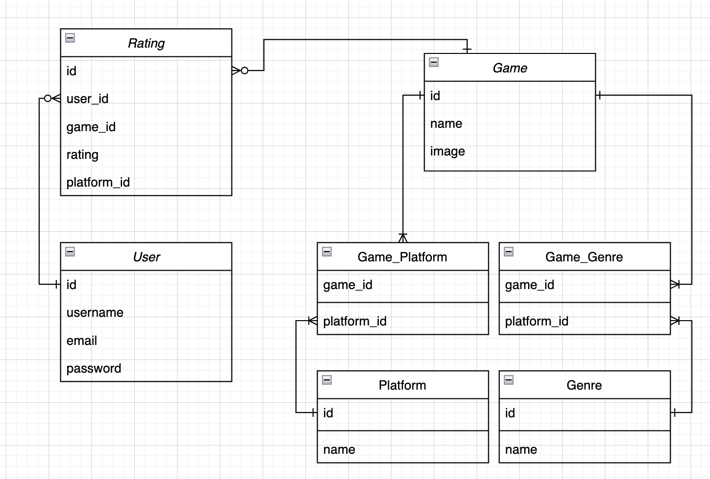

# Database Models

## Game

---

- id (Primary Key)
- name (Char)
- image (Char)
- platforms (Many To Many)
- Genre (Many To Many)

## Platform

---

- id (Primary Key)
- name (Char)

## Genre

---

- id (Primary Key)
- name (Char)

## Rating

---

- id (Primary Key)
- user (Foreign Key)
- game (Foreign Key)
- rating (Decimal)
- platform (Foreign Key)

## User

---

- id (Primary Key)
- username (Char)
- email (Char)
- password (Hashed)

