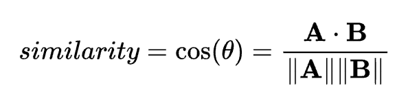
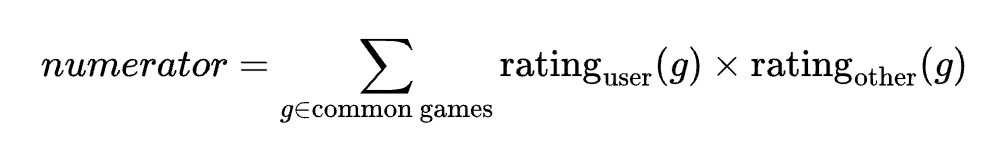
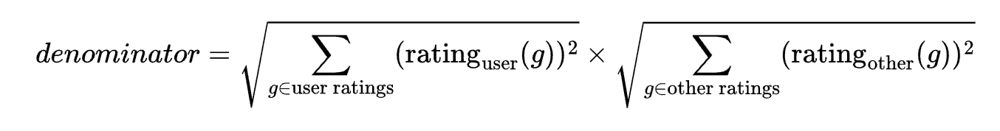
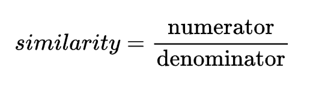
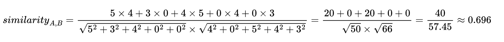
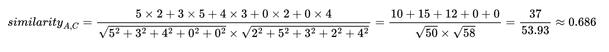
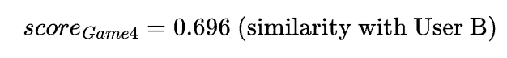
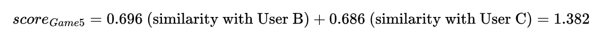

# User-Based Collaborative Filtering Recommendation System

## Overview

User-Based Collaborative Filtering is an algorithm used to predict items a user might like based on the ratings of other users with similar preferences. On my website, this algorithm is implemented to recommend games to users.

The recommendation process involves the following steps:

1. **Collect User Ratings:** Retrieve ratings given by the target user and all other users.
2. **Calculate Similarity:** Compute the similarity between the target user and other users using cosine similarity.
3. **Generate Recommendations:** Recommend games that similar users have rated highly, but the target user has not yet rated.

## Cosine Similarity

Cosine similarity is used to measure the similarity between two users' ratings vectors. The cosine similarity between vectors A and B is defined as:

**A⋅B** is the dot product of the vectors.

||**A**|| and ||**B**|| are the magnitudes of the vectors.

### Formula Breakdown

**Numerator:** The sum of the product of ratings for common games between the target user and the other user.

**Denominator:** The product of the magnitudes of the rating vectors of the target user and the other user.

**Similarity:** The cosine similarity score.

## Recommendation Generation

1. **Similarity Calculation:** For each user other than the target user, compute the cosine similarity score.
2. **Positive Ratings Filtering:** Identify games that the other user rated positively, where the rating is 3 or above.
3. **Recommendation Accumulation:** Accumlate similarity score for thats that the target user has not rated.
4. **Sorting and Selection:** Sort the games by accumulated similarity scores and select the top n recommendations.

## Example

A simple demostration on how games are recommended to user A.

### User Rating Matrix

| User | Game 1 | Game 2 | Game 3 | Game 4 | Game 5 |
| ---- | ------ | ------ | ------ | ------ | ------ |
| A    | 5      | 3      | 4      | 0      | 0      |
| B    | 4      | 0      | 5      | 4      | 3      |
| C    | 2      | 5      | 3      | 2      | 4      |

### Calculate Cosine Similarity

Similarity between User A and User B:

Similarity between User A and User C:

### Positive Rating Filtering

A game is considered positively rated if it has been rated a 3 or above.

- User B has rated Game 1, Game 3, and Game 4 positively.
- User C has rated Game 2 and Game 5 positively.

We also need to filter out games that User A has already rated based on the other users.

- User B: Game 1 and Game 3 has already been rated by user A.
- User C: User A has already rated Game 2.

Game 4 and Game 5 are games of interest.

### Accumlate Similarity Score for Recommendations

**Game 4**

**Game 5**

### Generate Top Recommendations

The sorted of list recommendated games for User A:

1.  Game 5 with a score of 1.382
2.  Game 4 with a score of 0.696
